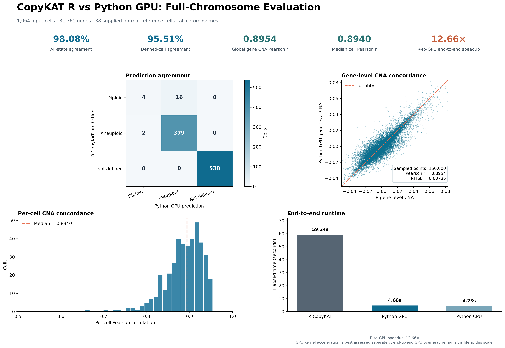

# copykat-gpu

`copykat-gpu` is a Python/PyTorch reimplementation of the CopyKAT workflow for inferring large-scale CNV profiles from single-cell RNA-seq counts. It preserves the major CopyKAT phases—quality filtering, genomic ordering, Freeman--Tukey normalization, smoothing, diploid baseline selection, segmentation, genomic binning, bin re-centering, cluster diagnostics, and aneuploidy calling—while moving numerical hot paths to PyTorch so they run on NVIDIA GPUs when CUDA is available.

## Scope

The original R source remains in the parent directory. This package is a compatible workflow reimplementation, **not a bit-for-bit replacement**: it reproduces R's hg20 cell-cycle/HLA exclusion, DLM smoothing, Poisson--Gamma posterior/KS segmentation, and Ward.D2 cluster construction. It samples the posterior for the R empirical-KS breakpoint test, then uses the exact Gamma posterior mean for segment levels to avoid unnecessary cross-runtime RNG variation. Validate against the R reference before clinical or publication use.

## Validation



## Installation

Use the default Python index when reachable:

```bash
python -m pip install -e '.[io,clustering,test]'
```

If GitHub/PyPI access is unreliable in mainland China, configure a mirror before installation:

```bash
python -m pip config set global.index-url https://pypi.tuna.tsinghua.edu.cn/simple
python -m pip install -e '.[io,clustering,test]'
```

Install a CUDA-compatible PyTorch build following the official PyTorch selector, then verify it:

```bash
python -c "import torch; print(torch.__version__, torch.cuda.is_available())"
```

`device="auto"` uses CUDA whenever `torch.cuda.is_available()` is true, otherwise it uses the same kernels on CPU.

## Inputs

- Expression: genes × cells, raw non-negative UMI/read counts, supplied as a `pandas.DataFrame`, CSV, or TSV. Files use the first column as gene IDs.
- Coordinates: a CSV/TSV/DataFrame with a gene identifier plus `chromosome`, `start`, and `end`. Symbol mode accepts `gene`, `symbol`, or `hgnc_symbol`; Ensembl mode accepts `ensembl_id` or `ensembl_gene_id`.

Use a coordinate reference from the intended genome assembly that matches the expression gene IDs.

## Example

```python
import pandas as pd
from copykat_gpu import copykat

counts = pd.read_csv("counts.tsv", sep="\t", index_col=0)
coordinates = pd.read_csv("hg38_gene_coordinates.tsv", sep="\t")
result = copykat(
    counts,
    coordinates,
    known_normal_cells=["AAACCTGAGAAACCAT-1"],
    device="auto",
)
result.prediction.to_csv("sample_copykat_prediction.tsv", sep="\t")
result.cna.to_csv("sample_copykat_bin_by_cell.tsv", sep="\t", index=False)
```

`classification="normal_mad"` is the default. It derives an aneuploidy cutoff
from the supplied normal-reference cells using the reference-score median by
default (`normal_mad_multiplier=0.0`). This deliberately preserves sensitivity
to broad low-amplitude CNAs; increase `normal_mad_multiplier` for a more
conservative `median + multiplier × 1.4826 × MAD` cutoff. Use
`classification="copykat_cluster"` to select the GPU CopyKAT-style bin-cluster
decision, or `classification="threshold"` only with a validated,
dataset-specific `aneuploidy_threshold`. Cells failing chromosome-coverage QC
are returned as `not.defined`, following the R output convention.

## GPU paths

Freeman--Tukey normalization, DLM smoothing, pairwise distances, Poisson--Gamma sampling for empirical-KS segmentation, analytic posterior-mean segment levels, CopyKAT hg20 target-bin aggregation, and aneuploidy scoring execute through PyTorch on the selected device. The default `binning="copykat_hg20"` uses the bundled R target-bin coordinates and nearest-bin fill rule; `binning="coordinate"` retains the generic coordinate-window fallback. Ward.D2 linkage/tree cutting uses SciPy on CPU to preserve R's hierarchical-clustering semantics; input/output parsing and DataFrame assembly are also CPU-bound.
